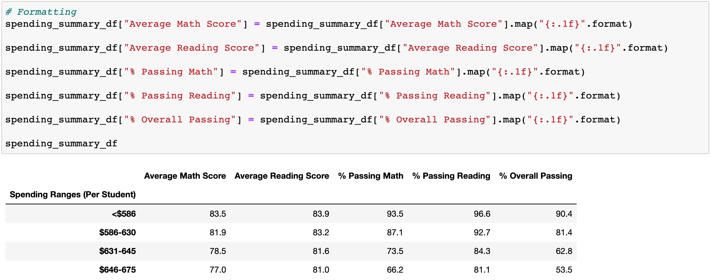
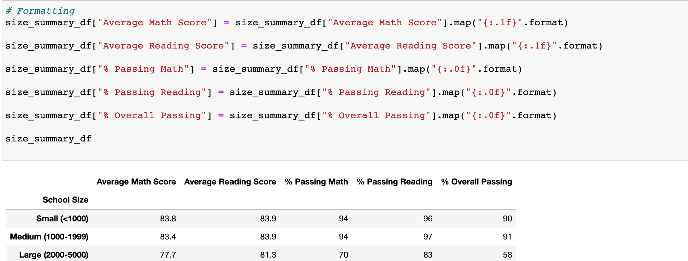

# School_District_Analysis

# Overview
  The overview for this assignment was to assist Maria (the cheif data scientist for a city school district) in gathering data on many different schools by finding out their repective averages in thier math and rading scores. In addition, we were tasked in finding out infomration regarding the size and finding of the schools to see if any trend can be seen in school performance. 
  When working on this goal, the school board infomred Maria and I that the CSV file used for this assignment shows evidence of academic dishonesty amoung the reading and amth grades for Thomas High School. I wask tasked in replaced the math and reading grades for Thomas High School as "NaN" while keeping the rest of the data intact. Once this was completed, I was also tasked in repeating the analysis and explain how the changes made affected the analysis as a whole.

# Results
### District Summary
  When we found out Thomas High School showed evidence of academic dishonesty, we had to essentailly restart the analysis by replacing the grades for Thomas High School with "NaN" and start again. 
  - At the end of the day when comparing the origonal analysis and the adjusted analysis, despite the 9th graders for Thomas High School having a grade value of NaN due to dishonesty, the summaries did not change much. What I saw was that there was less than a 1% chance between the average scores for the students. For example,in the origonal analysis, the percentage of students passing reading was 85.8% and in the adjusted analysis, the scores were 86%. This slight raise can be due to the fact that the 9th graders at Thomas High School did not do so well collectively in the reading of standardized tests. There was also another small change in the overall percentage of students passing. In the origional anlaysis, the overall percentage for students passing was 65.2% and in the adjusted analysis, the score was lowered to 65%. Even though replaceing the scores of THS with NaN didnt change much, the overall scores did change. 

##### Original 

##### Adjusted

### School Summary 
  Looking at the school school summary, the scores of Thomas High School were drastically changed. In the original school summary, the largest changes can be seen in the percentages across the board. For example, the original passing percentages for math, reading and overall are 93.27%, 93.27%, 90.95% respectively. When looking at the adjusted scores, we see the biggest change in where the scores go from the nineties to the mid and high sixties. The percentages for math, reading, and overall were 66.91%, 69.66%, and 65.07%. This drastic change in the scores has to be from the academic dishonesty we found out about in the beginning. 

##### Original 

##### Adjusted 

### How does replacing the ninth grader's math and reading scores affect Thomas High School's performance?
  Replaceing the nith grader's scores with "NaN" changed the standing of THS drastically. Originally, the school was at the top 5 best schools but with the adjested analysis, Thomas High School ended up being at the bottom five schools. 
  
##### Original

##### Adjusted

### How does replacing the ninth-grade scores affect...:

#### Math and reading scored by grade:
 Oriognally, the math and reading scores for all grades at Thomas High School is in the 80's
  - 9th Grade Math Scores: 83.7
  - 10th Grade Math Scores: 83.7
  - 11th Grade Math Scores: 83.6
  - 12th Grade Math Scores: 83.8
Original Reading Scores:
  - 9th Grade: 83.6
  - 10th Grade: 83.1
  - 11th Grade: 83.5
  - 12th Grade: 83.5

With the changes to the Thomas High School ninth grade scores to NaN, there was not much of a drastic change between the scores. The scores only changed by less than 2%

##### Original

##### Adjusted

#### Scores by School Spending 
  Thomas High School was in the $630-$644 spending range. The percentages in the adjusted analysis saw nominal changes.

##### Original

##### Adjusted 

#### Scores by School Size
  Thomas High School is classified as a "Medium" sized school. Despite the changes made to the grades, there were nominal changes to these tables.

##### Original

##### Adjusted 

#### Scores by School Type
  Thomas High School is a charter school based on the table. There were small changes that cosisted of rounded up percentages.
  
##### Original

##### Adjusted

# Summary 
Based on the adjusted school analysis, I noticed four changes:
1. The overall passing rate of Thomas High School was drastically lowered from 90% to 65% due to the academic dishonesty.
2. Due to the academic dishonesty from Thomas High School, their overall ranking was lowered from the near top of the schools to close to the bottom.
3. As per the reuqest, the THS ninth grade scores were replaced and are now recorded as "NaN" due to dishonesty. BEcause of this we do not have accurate scores for their school grade specifically.
4. There were sight shifts to all the scores due to the omission of scores from Thomas High School. The only drastic change was the overall passing rate for THS while othe schools stayed the same.

# Resources 
- Anaconda
- Conda
- Jupyter Notebook
- Python
- Pandas
- ipyKernel
